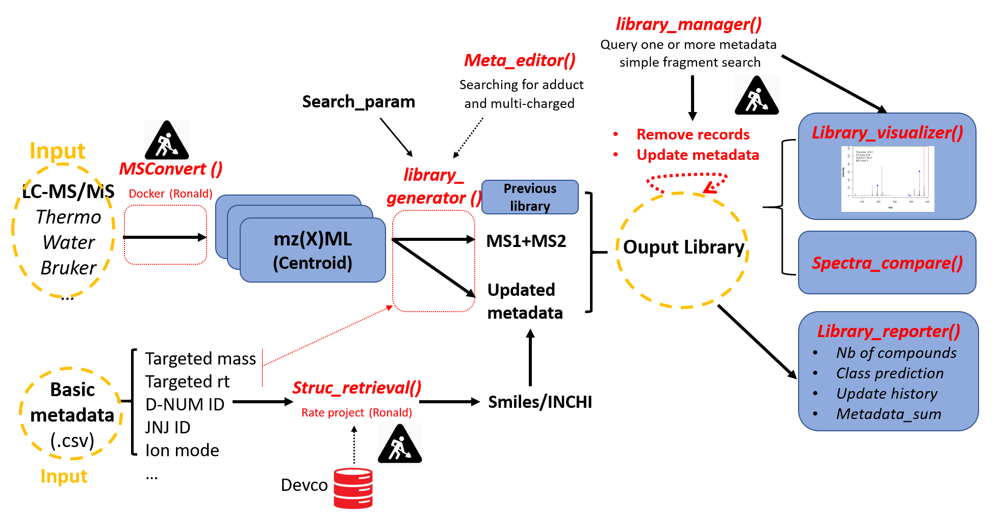
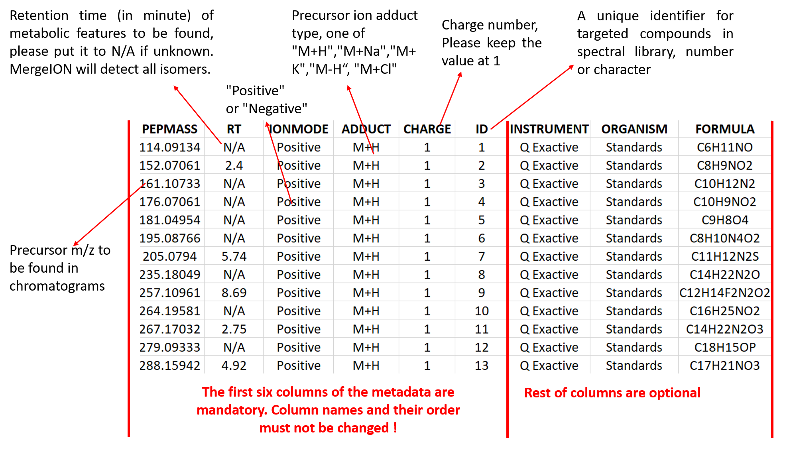

# MergeION: Batch processing of LC-MS/MS chromatograms into a spectral library

In tandem mass spectrometry-based metabolomics, automated structure identification is usually performed by spectral library search and in silico fragmentation (smart algorithms).
The missing steps towards complete automation are the pre-processing and format conversion of raw chromatograms acquired in DDA (Data-driven acquisition) or targeted MS/MS-mode. 
The package fills these gaps and enables batch-processing of selected MS/MS scans on commonly used structure elucidation software, including CSI:FingerID, MSFinder, GNPS and Metfrag. 
To achieve this, MS/MS scans from one or multiple raw chromatogram files are extracted according to m/z (and retention time) provided by users. 
They are then merged into a single "spectral library" and can be exported to different formats compatible with different software tools. Users can also use this package to build their own spectral library by adding metadata. The following pipelin shows the key steps achieved by the package:



Following steps need to be performed before using this package:

## 1. Install devtools (only if it has not been installed)

Make sure you have a valid working development environment:
* Windows: please install Rtools at https://cran.r-project.org/bin/windows/Rtools/
* Mac: Install Xcode from the Mac App Store.
* Linux: Install a compiler and various development libraries (details vary across different flavors of Linux).

```R
install.packages("devtools")
```

## 2. Installation from Github in Rstudio (with devtools)

```R
library(devtools)
install_github("daniellyz/MergeION")
library(MergeION)
```
## 3. Please check the function manuals before starting

```R
help(MergeION)
help(library_generator)
help(CSI_FingerID_writer)
```

## 4. Data format conversion

Raw LC-MS/MS files must be in centroid/line spectra-mode and in mzML, mzXML or mzData format. Such files can be usually exported from LC-MS vendor software, e.g. with Bruker Compass DataAnalysis 4.3:


If such function is not available in vendor software or user want to convert many raw files at the same time, we recommend an alternative solution with MSConvertGUI (part of proteowizard: http://proteowizard.sourceforge.net/download.html). The software is able to batch-convert raw chromatogram files of most vendors' formats into centroid-mode mzML or mzXML files. Following instructions are given for batch-conversion of profile-mode Bruker and Water's chromatograms:


To test our package, please type following commands in Rstudio to download example datasets. More backgrounds of these datasets can be found at: https://zenodo.org/record/1326555.

```R
url = "https://zenodo.org/record/1326555/files/"
original_files = c("TESTMIX2_180504_MAS011_06.mzXML",
                    "JNJ42165279_171214_MAS006_14.mzXML",
                    "GMP_R601592_150925_MAS006_04.mzXML")
download.file(paste0(url,original_files[1]),destfile="F1.mzXML") # Download and rename the files
download.file(paste0(url,original_files[2]),destfile="F2.mzXML")
download.file(paste0(url,original_files[3]),destfile="F3.mzXML")
```
## 5. Check spectra baseline

Mass spectra show usually a baseline caused by chemical noise in matrix or by ion overloading. Users can define such baseline for each LC-MS/MS file so that only significant mass peaks are saved. Such filter can reduce spectral library size and improve chemical identification. The baselines can be roughly determined by visualizing MS1 scans. Data acquired on the same MS instrument usually have similar baseline levels.


## 6. Preparation of metadata

The metadata contains the metabolic features to be extracted from chromatogram(s). It must be a semicolon-separated .csv file where each row represents a targeted metabolic feature (PEPMASS, RT, IONMODE, ADDUCT and ID). Other information of metabolic feature can be added and will be found in the final merged library. A single metadata should be used for batch-processing the list of chromatogram files. The example metadata can be downloaded at https://zenodo.org/record/1326555:




## Library generator

Now you will see an example of how a spectral library is built from two LC-MS/MS data:

```R
raw_data_files = c("F1.mzXML","F2.mzXML")

url = "https://zenodo.org/record/1326555/files/"
metadata_file = paste0(url,"library_metadata.csv")

mslevel = c(1,2) 
# Both MS1 and MS2 scans are extracted! MS1 scan contains isotopic pattern of targeted m/z and can improve identification

MS2_type = c("DDA","Targeted") # Mode of MS/MS experiment for F1 and F2 respectively
rt_search = 12 # Retention time tolerance (s)
ppm_search = 10  # Mass tolerance (ppm)
baseline = 1000  # Baseline level 1000 is fixed for both chromatograms
consensus.algorithm = "None" # Currently we don't merge spectra with same ID
input_library = "" # A brand new library, there's no previous dependency
output_library = "library_V1.mgf" # Name of the library

library1 = library_generator(raw_data_files, metadata_file, mslevel, MS2_type, rt_search, ppm_search,
       baseline,normalized = T, consensus.algorithm, input_library, output_library)
```
