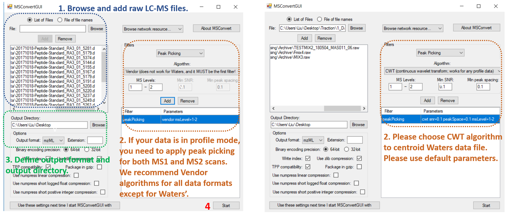
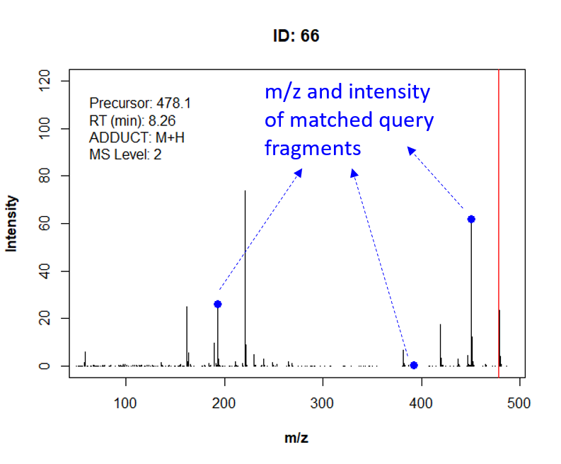

# MergeION: Batch processing of LC-MS/MS chromatograms into a spectral library

In tandem mass spectrometry-based metabolomics, automated structure identification is usually performed by spectral library search and in silico fragmentation (smart algorithms). For both approaches, the missing steps towards automation are the pre-processing and format conversion of raw chromatograms acquired in DDA (Data-driven acquisition) or targeted MS/MS-mode. As for, following steps are usually performed chromatogram by chromatogram, spectrum by spectrum in vendor software & text editors: selecting MS/MS scans, processing spectra, copying them along with metadata (e.g.ion mode, compound name...) into in-house database (for chemical standards) or structure identification software (for unknowns). Our package fills these gaps and enables: i) automated spectral library generation; ii) batch-processing LC-MS/MS data on commonly used structure elucidation software (CSI:FingerID, MSFinder, GNPS and Metfrag).  
MS1 and MS2 scans from one or multiple raw chromatogram files are first extracted according to m/z (and retention time) provided by users. They are then merged into a GNPS-style spectral library and can be later converted to formats compatible with different software tools. The following pipeline shows the key steps achieved by the package:


Following steps need to be performed before using this package:

## 1. Install devtools (only if it has not been installed)

Make sure you have a valid working development environment:
* Windows: please install Rtools at https://cran.r-project.org/bin/windows/Rtools/
* Mac: Install Xcode from the Mac App Store.
* Linux: Install a compiler and various development libraries (details vary across different flavors of Linux).

```R
install.packages("devtools")
```

## 2. Installation from Github in Rstudio (with devtools)

```R
library(devtools)
install_github("daniellyz/MergeION")
library(MergeION)
```
## 3. Please check the function manuals before starting

```R
help(MergeION)
help(library_generator)
help(CSI_FingerID_writer)
```

## 4. Data format conversion

Raw LC-MS/MS files must be in centroid/line spectra-mode and in mzML, mzXML or mzData format. Such files can be usually exported from LC-MS vendor software, e.g. with Bruker Compass DataAnalysis 4.3:


If such function is not available in vendor software or user want to convert many raw files at the same time, we recommend an alternative solution with MSConvertGUI (part of proteowizard: http://proteowizard.sourceforge.net/download.html). The software is able to batch-convert raw chromatogram files of most vendors' formats into centroid-mode mzML or mzXML files. Following instructions are given for batch-conversion of profile-mode Bruker and Water's chromatograms:



To test our package, please type following commands in Rstudio to download example datasets. More backgrounds of these datasets can be found at: https://zenodo.org/record/1326555.

```R
url = "https://zenodo.org/record/1326555/files/"
original_files = c("TESTMIX2_180504_MAS011_06.mzXML",
                    "JNJ42165279_171214_MAS006_14.mzXML",
                    "GMP_R601592_150925_MAS006_04.mzXML")
download.file(paste0(url,original_files[1]),destfile="F1.mzXML") # Download and rename the files
download.file(paste0(url,original_files[2]),destfile="F2.mzXML")
download.file(paste0(url,original_files[3]),destfile="F3.mzXML")
```
## 5. Check spectra baseline

Mass spectra show usually a baseline caused by chemical noise in matrix or by ion overloading. Users can define such baseline for each LC-MS/MS file so that only significant mass peaks are saved. Such filter can reduce spectral library size and improve chemical identification. The baselines can be roughly determined by visualizing MS1 scans in vendor software or MZMine. Data acquired on the same MS instrument usually have similar baseline levels.


## 6. Preparation of metadata

The metadata contains the metabolic features to be extracted from chromatogram(s). It must be a semicolon-separated .csv file where each row represents a targeted metabolic feature (PEPMASS, RT, IONMODE, ADDUCT and ID). Other information of metabolic feature can be added and will be found in the final merged library. A single metadata should be used for batch-processing the list of chromatogram files. The example metadata can be downloaded at https://zenodo.org/record/1326555:


## Example 1: generating an in-house spectral library of drug standards

An example of how a spectral library is built from two LC-MS/MS data:

```R
raw_data_files = c("F1.mzXML","F2.mzXML")

url = "https://zenodo.org/record/1326555/files/"
metadata_file = paste0(url,"library_metadata.csv")

mslevel = c(1,2)  # Both MS1 and MS2 scans are extracted! 

MS2_type = c("DDA","Targeted") # Mode of MS/MS experiment for F1 and F2 respectively
rt_search = 12 # Retention time tolerance (s)
ppm_search = 10  # Mass tolerance (ppm)
baseline = 1000  # Baseline level 1000 is fixed for both chromatograms
input_library = "" # A brand new library, there's no previous dependency
output_library = "library_V1.mgf" # Name of the library

library1 = library_generator(raw_data_files, metadata_file, mslevel, MS2_type, rt_search, ppm_search,
       baseline, normalized = T, input_library, output_library)
```

Two files are added in the working directory: 1) The library file "library_V1.mgf". The library format is inspired from GNPS database (https://gnps.ucsd.edu/ProteoSAFe/static/gnps-splash.jsp) and it consists of both metadata and spectra data. The "scans" are copies of MS1/MS2 spectra detected in raw LC-MS/MS files together with user-provided metadata. For MS1 scans, only the part of spectrum where isotopic patterns are located is saved. Segment of spectrum that contains fragments and precursor ion are saved for MS2 scans. Both MS1 and MS2 spectra are filtered according to baseline and can be normalized so that the highest the peak has an intensity of 100. 2) Metadata file "library_V1.mgf.txt", a tab-separated that can be read into a matrix in Excel. It contains metadata of all targeted scans (MS1 and MS2) with additional information:  


### Update the spectral library

Now we add a new data F3.mzXML in existing library:

```R
raw_data_files2 = "F3.mzXML" # The new LC-MS/MS data
metadata_file2 = metadata_file # The targeted m/z is already written in input metadata
MS2_type = "DDA" 
input_library = "library_V1.mgf" # The first mgf file of library1
output_library = "library_V2.mgf" # The name of the new spectral library

library2 = library_generator(raw_data_files2, metadata_file2, mslevel, MS2_type, rt_search, ppm_search,
       baseline, normalized = T, input_library, output_library)
```

Two new files should appear in the working directory: 1) Library file "library_V2.mgf". 2) "library_V2.mgf.txt".

### Visualize spectra

Following function allows user visualize all detected scans of a metabolic feature by specifying its ID: 

```R
# We visualize ID = 28 (known as glutathion)
visualize.spectra(library2,ID=28)
# The same thing:
visualize.spectra("library_V2.mgf",ID=28)
```
### Generate consensus library

One metabolic feature can be detected more than once resulting in multiple scans for the same ID (e.g. detected in two chromatograms, multiple adduct types are detected...). The function process_library() keeps only two scans (one MS1 and one MS2) for each metabolic feature. It suggests three approaches:  

```R
# Approach 1: keeping the scan (MS1 and MS) with highest TIC for each ID:
library2_1=process_library("library_V2.mgf", consensus=F, output_library="library_V2_0.mgf")

# Approach 2: Combining all peaks that are present in at least one spectrum of the same ID. 
library2_2=process_library("library_V2.mgf", consensus=T, ppm_window=10, output_library="library_V2_consensus.mgf")
visualize.spectra(library2_2,ID=28)

# Approach 3: Keeping only peaks that are present in all scans of the same ID.
library2_3=process_library("library_V2.mgf", consensus=T, ppm_window=10, strict=T, output_library="library_V2_common.mgf")
visualize.spectra("library_V2_common.mgf",ID=28)
```
Approaches 2 and 3 are achieved by the alignment of m/z across spectra and averaging intensity. Therefore, the spectra should be normalized. Metadata is saved for the scan with highest TIC. The new library is called "consensus library". Here is an example of glutathion scans in original and processed spectral libraries. There are two MS2 scans detected in original library2 (M+H and M+Na adduct types). The scan in library2_2 is the superposition of two scans, while library2_3 only keeps one mass peak that is present in both scans:


### Search fragments in the library

To match fragment m/z to in-house reference library:

```R
query_fragments = c(193.08,392.23,450.06)
match.fragments("library_V2.mgf",query_fragments,match="All")
```

The function outputs IDs and scan numbers of all library items that contain query fragments. Moreover, reference mass spectra are visualized:



