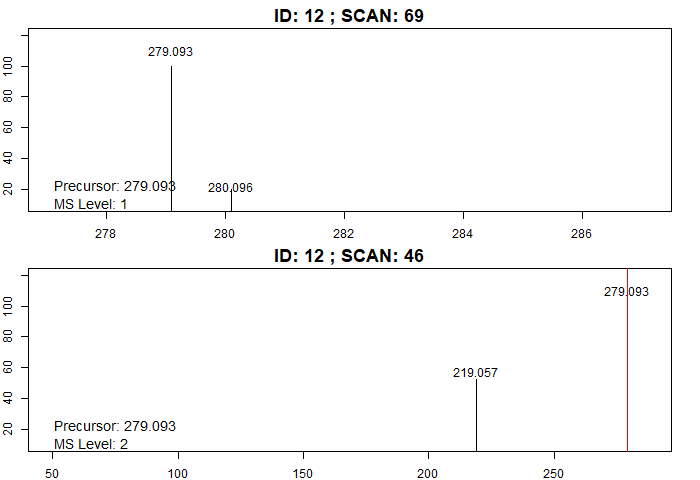

```{r  biocstyle, echo = FALSE, results = "asis" }
BiocStyle::markdown() 
```

# Introduction

The datasets for Example 1 are provided by Janssen Pharmaceutica. It consists of known standard pharmaceutical compounds for which high quality Q-Exactive MS/MS data is provided. Names and structures of these compounds can be found in the metadata. All datasets were acquired in positive ion mode through either DDA (data-dependent acquisition) or targeted MS/MS. Raw data in profile mode were converted into centroid-mode mzML or mzXML files using MSConvertGUI. Please type following commands in Rstudio to download raw datasets.

```R
url = "https://zenodo.org/record/1326555/files/"
original_files = c("TESTMIX2_180504_MAS011_06.mzXML",
                    "JNJ42165279_171214_MAS006_14.mzXML",
                    "GMP_R601592_150925_MAS006_04.mzXML")
download.file(paste0(url,original_files[1]),destfile="F1.mzXML") # Download and rename the files
download.file(paste0(url,original_files[2]),destfile="F2.mzXML")
download.file(paste0(url,original_files[3]),destfile="F3.mzXML")
```
# Building the first spectral library

```R
raw_data_files = c("F1.mzXML","F2.mzXML")
metadata_file = paste0(url,"library_metadata.csv")

mslevel = c(1,2)  # Both MS1 and MS2 scans are extracted! 

MS2_type = c("DDA","Targeted") # Mode of MS/MS experiment for F1 and F2 respectively
rt_search = 12 # Retention time tolerance (s)
ppm_search = 10  # Mass tolerance (ppm)
baseline = 1000  # Baseline level 1000 is fixed for both chromatograms
input_library = "" # A brand new library, there's no previous dependency
output_library = "library_V1.mgf" # Name of the library

library1 = library_generator(raw_data_files, metadata_file, mslevel, MS2_type, rt_search, ppm_search,
       baseline, normalized = T, input_library, output_library)
```

Two files are added in the working directory: 1) The library file "library_V1.mgf". The library format is inspired from GNPS database (https://gnps.ucsd.edu/ProteoSAFe/static/gnps-splash.jsp) and it consists of both metadata and spectra data. The "scans" are copies of MS1/MS2 spectra detected in raw LC-MS/MS files together with user-provided metadata. For MS1 scans, only the part of spectrum where isotopic patterns are located is saved. Segment of spectrum that contains fragments and precursor ion are saved for MS2 scans. Both MS1 and MS2 spectra are filtered according to baseline and can be normalized so that the highest the peak has an intensity of 100. 2) Metadata file "library_V1.mgf.txt", a tab-separated that can be read into a matrix in Excel. It contains metadata of all targeted scans (MS1 and MS2) with additional information:  

{width=80%}

# Update the spectral library

Now we add a new data F3.mzXML in existing library:

```R
raw_data_files2 = "F3.mzXML" # The new LC-MS/MS data
metadata_file2 = metadata_file # The targeted m/z is already written in input metadata
MS2_type = "DDA" 
input_library = "library_V1.mgf" # The first mgf file of library1
output_library = "library_V2.mgf" # The name of the new spectral library

library2 = library_generator(raw_data_files2, metadata_file2, mslevel, MS2_type, rt_search, ppm_search,
       baseline, normalized = T, input_library, output_library)
```

Two new files should appear in the working directory: 1) Library file "library_V2.mgf". 2) "library_V2.mgf.txt".

# Visualize spectra in the library

Following function allows user visualize all detected scans of a metabolic feature by specifying its ID: 

```R
# We visualize ID = 28 (known as glutathion)
visualize.spectra(library2,ID=28)
# The same thing:
visualize.spectra("library_V2.mgf",ID=28)
```
# Generate consensus library

One metabolic feature can be detected more than once resulting in multiple scans for the same ID (e.g. detected in two chromatograms, multiple adduct types are detected...). The function process_library() keeps only two scans (one MS1 and one MS2) for each metabolic feature. It suggests three approaches:  

```R
# Approach 1: keeping the scan (MS1 and MS) with highest TIC for each ID:
library2_1=process_library("library_V2.mgf", consensus=F, output_library="library_V2_0.mgf")

# Approach 2: Combining all peaks that are present in at least one spectrum of the same ID. 
library2_2=process_library("library_V2.mgf", consensus=T, ppm_window=10, output_library="library_V2_consensus.mgf")
visualize.spectra(library2_2,ID=28)

# Approach 3: Keeping only peaks that are present in all scans of the same ID.
library2_3=process_library("library_V2.mgf", consensus=T, ppm_window=10, strict=T, output_library="library_V2_common.mgf")
visualize.spectra("library_V2_common.mgf",ID=28)
```
Approaches 2 and 3 are achieved by the alignment of m/z across spectra and averaging intensity. Therefore, the spectra should be normalized. Metadata is saved for the scan with highest TIC. The new library is called "consensus library". Here is an example of glutathion scans in original and processed spectral libraries. There are two MS2 scans detected in original library2 (M+H and M+Na adduct types). The scan in library2_2 is the superposition of two scans, while library2_3 only keeps one mass peak that is present in both scans:

{width=80%}

# Search fragments in the library

To match fragment m/z to in-house reference library:

```R
query_fragments = c(193.08,392.23,450.06)
match.fragments("library_V2.mgf",query_fragments,match="All")
```

The function outputs IDs and scan numbers of all library items that contain query fragments. Moreover, reference mass spectra are visualized:

{width=80%}


